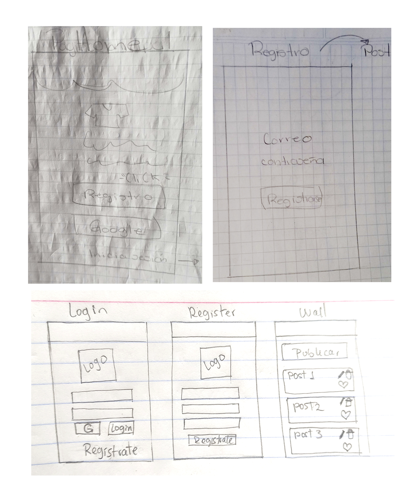
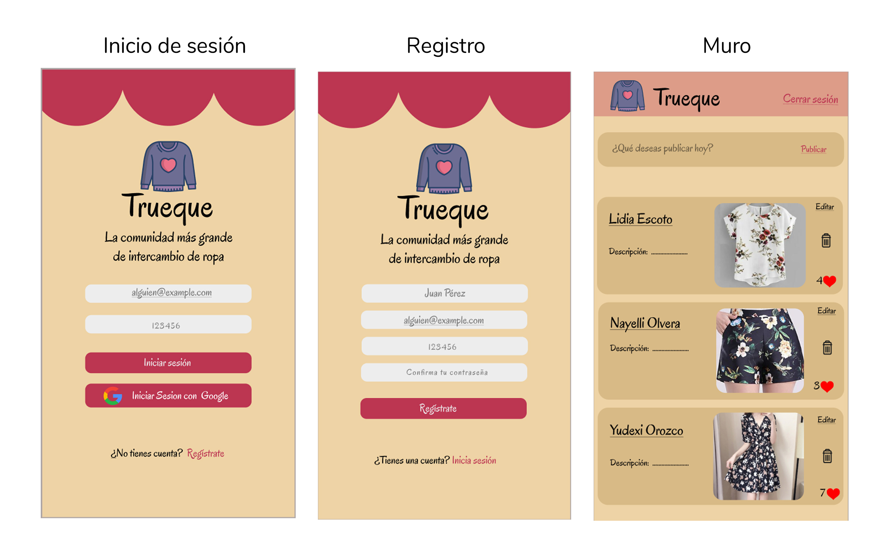
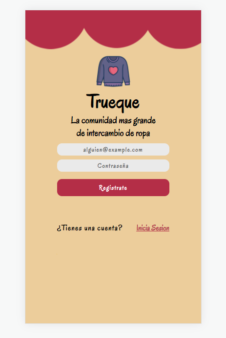
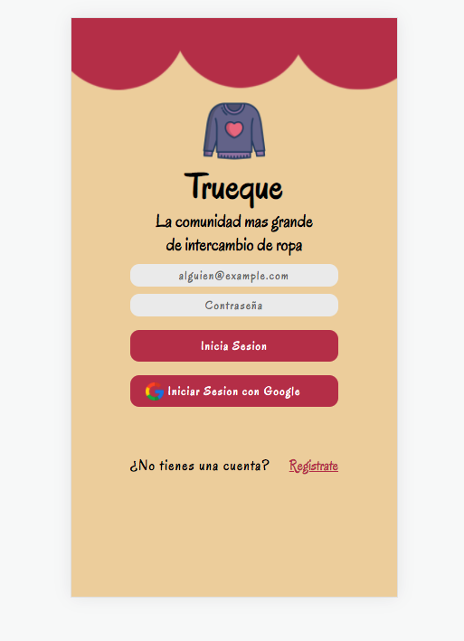
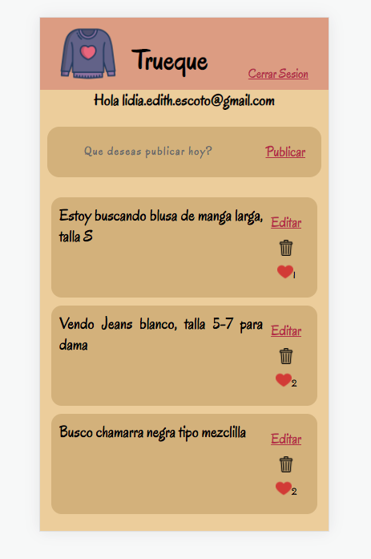

# Creando una Red Social

## Índice

* [1.Definición de proyecto](#1-definición-de-proyecto)
* [2. Historias de usuario](#2-historias-de-usuario)
* [3. Prototipos](#3-prototipos)
* [4. Test de usabilidad](#4-test-de-usabilidad)
* [5. Interfaz final](#5-Interfaz-final)
* [6. Links](#6-links)

## 1. Preámbulo
En los últimos años la industria de la moda ha representado un fuerte golpe para la ecología de nuestro planeta, es por eso que se han creado diversas propuestas para intentar minimizar este impacto, una de ellas es el reciclado de ropa mediante su intercambio es por eso que desarrollamos una aplicación que permite conectar a nuestros usuarios interasados en esta problematica, brindandoles un espacio específicamente para poder realizar esta actividad en línea.

## 2. Historias de usuario
Para culminar este proyecto nos enfocamos en las principales necesidades de los usuarios para que estos pudieran comenzar a probar la aplicación.

**HISTORIA DE USUARIO 1**
H.U.#1 Yo: como usuario de trueque. Quiero: registrarme en la aplicación. Para: crear una cuenta en la app.

Criterios de aceptación:
- [ ] Registro en la app con correo o cuenta de Google.
- [ ] La contraseña debe ser secreta.
- [ ] Poder ingresar desde el celular.

Definición de terminado:
- [ ] Prototipo de baja y alta fidelidad de esta primera historia.
- [ ] Vincular las cuentas registradas con el Firebase.
- [ ] Uso del input de tipo password.
- [ ] Todo esta realizado en SPA (single page aplication)
- [ ] La app es responsive para tablet y desktop.

**HISTORIA DE USUARIO 2**
H.U.#2 Yo: como usuario de trueque. Quiero: tener acceso al menú principal de la app. Para: crear, editar, borrar y likear una publicación.

Criterios de aceptación:
- [ ] Poder iniciar sesión con el correo o cuenta de Google.
- [ ] Recibir una alerta si los datos son incorrectos.
- [ ] Al iniciar sesión encontrar el menú principal.
- [ ] Poder crear, editar, borrar y likear una publicación.

Definición de terminado:
- [ ] La cuenta de usuario debe ser un correo electrónico válido.
- [ ] Debe ser una cuenta por usuario.
- [ ] Si hay errores, se deben mostrar mensajes descriptivos para ayudar al usuario a corregirlos.
- [ ] Lo implementado debe ser en mobile first.
- [ ] Crear una publicación
- [ ] Borrar una publicación
- [ ] Editar una publicación
- [ ] Darle like a una publicación
- [ ] Crear botón para cerrar sesión en la vista del muro.

## 3. Prototipos

**Sketch(baja fidelidad)**

**Prototipo(alta fidelidad)**

## 4. Test de usabilidad
Los problemas que se detectaron mediante los test de usabilidad y feddbacks fueron en cuanto a diseño:

*Colores de los botones.
*Los placeholder cambiaron su contenido.
*Tamaño de la letra.
*Espaciado de las letras.

## 5. Interfaz final

## 6. Links

* [ Trello ](https://trello.com/b/3jxYs1zJ/red-social)

* [ Figma ](https://www.figma.com/file/Rn2atLBKgvIH16Tu6ufbW2/RED-SOCIAL?node-id=16%3A23)
