# Creando una Red Social : PIC&ART

## Índice

* [1. Resumen del proyecto](#1-resumen-del-proyecto)
* [2. Definición del producto](#2-definición-del-producto)
* [3. Historias de usuario](#3-historias-de-usuario)
* [4. Prototipos](#4-prototipos)

## 1. Resumen del proyecto

Red social dirigida a artistas de cualquier tipo, donde pueden compartir ideas, proyectos, creaciones, exposiciones y puedan sentirse parte de una comunidad ideal para ellos, así como para cualquier amante del arte en general.

Elaborada por: 
 - Flor Angelica Jardinez Hernandez
 - Nancy Janet Díaz Menchaca
 - Paola Colette Ordoñez Rodríguez 

## 2. Definición del producto

Se realizó  una red social dirigida a artistas y público en general interesados en este tema, consistió en construir una single page aplication (SPA) donde los contenidos cargaran de una manera más fluida y sencilla para el usuario, sin necesidad de tener que redirigir a otras páginas en todo momento. Además de ser ua aplicación responsiva, se puede interactuar con ella desde dispositivos móviles y computadoras.
Esta permite registrarse con cualquier cuenta de correo electrónico, así como iniciar sesión de forma directa con cuentas de Google y GitHub. 
En la sección del muro se observan las publicaciones de otros usuarios y las propias, se pueden dar y quitar likes de estas, además de crear, editar y eliminar los post del usuario que ha iniciado sesión en la red.

**¿Cuáles son los datos más relevantes que quieren ver en la interfaz y por qué?**
Ilustraciones y/o dibujos que pueden ser inspiración para sus obras u otros artistas, además de recibir opiniones de la comunidad.

**¿Cuándo utilizan o utilizarían el producto?**
Cuando quieran compartir sus creaciones o busquen algún estilo o género de arte.

## 3. Historias de Usuario

A lo largo del proyecto, se realizaron siete historias de usuario con el fin seccionar tareas para la elboración de la red social:

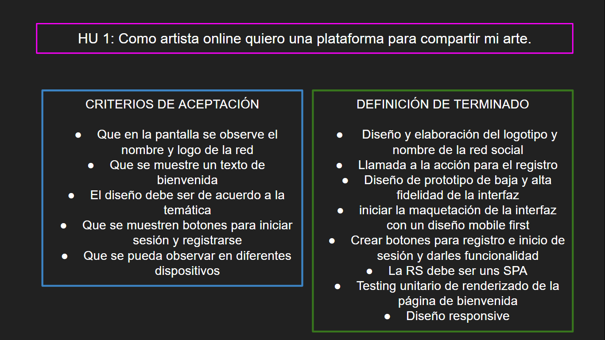
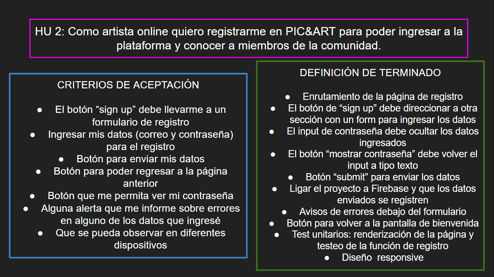
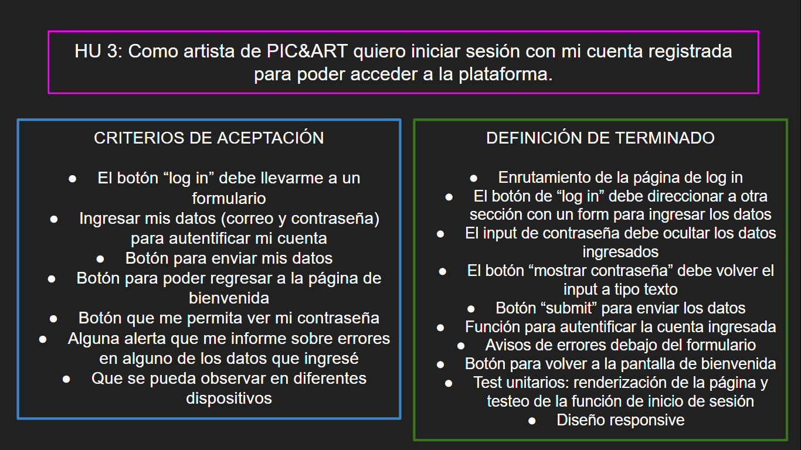
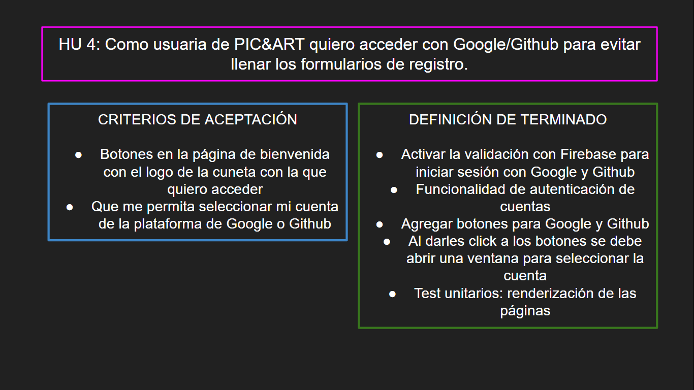
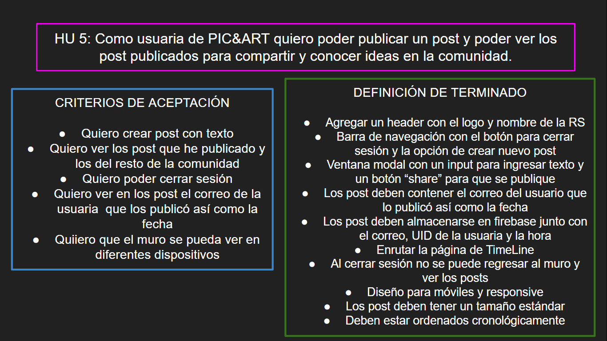
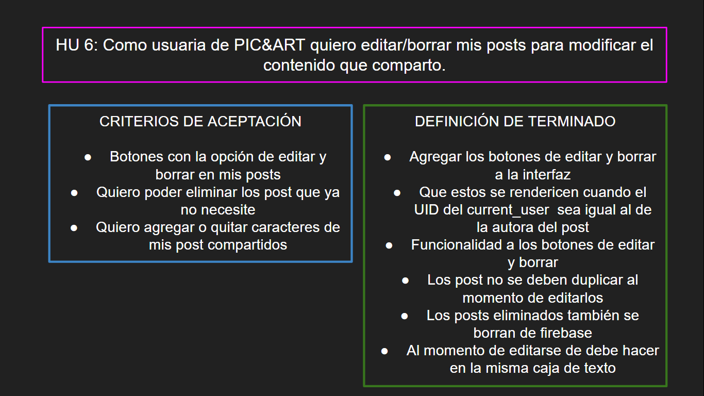
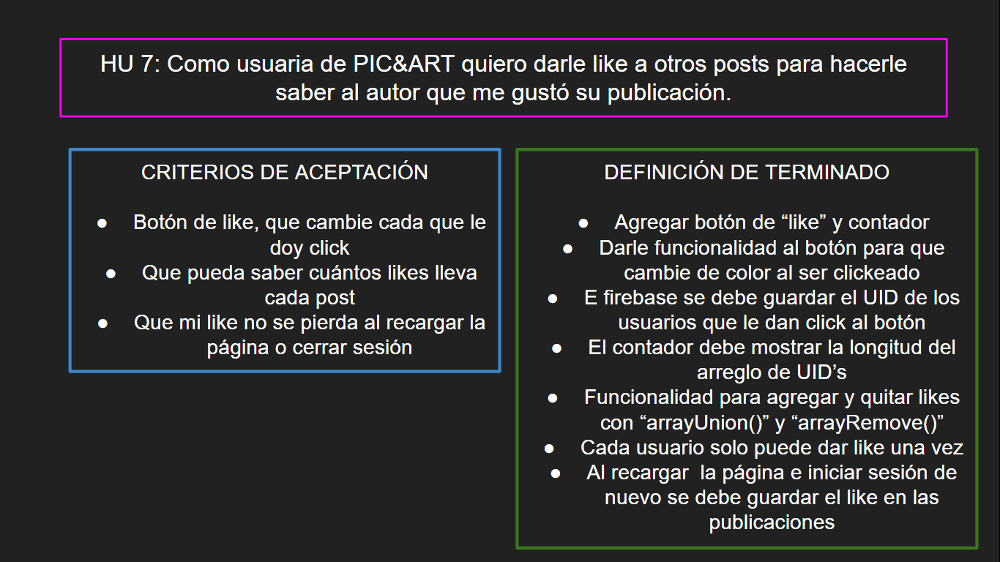

## 4. Prototipos

Con base en las primeras tres historias de usuario (página de bienvenida, registro e inicio de sesión), se diseñaron prototipos de baja fidelidad para su iteración.

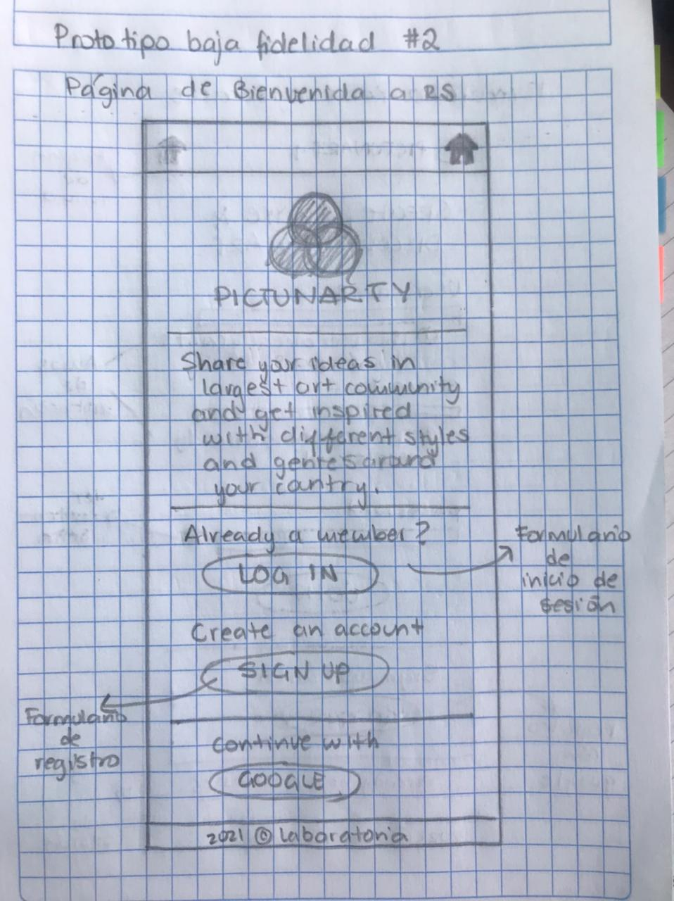

Posteriormente, con la herramienta Figma se diseñaron los prototipos de alta fidelidad donde se propuso el siguiente diseño:  

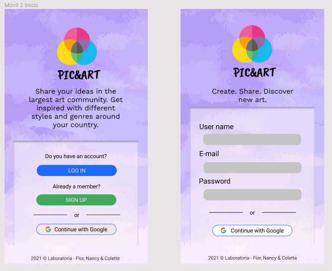

Después de consultarlo con diferentes usuarios y tomando en cuenta sus comentarios, se modificó el diseño final:

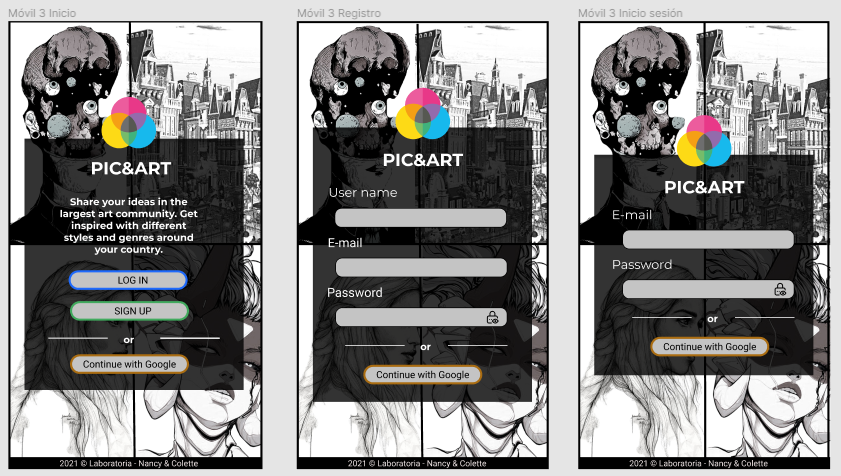

### Vista final
Vista final de la interfaz para dispositivos móviles:

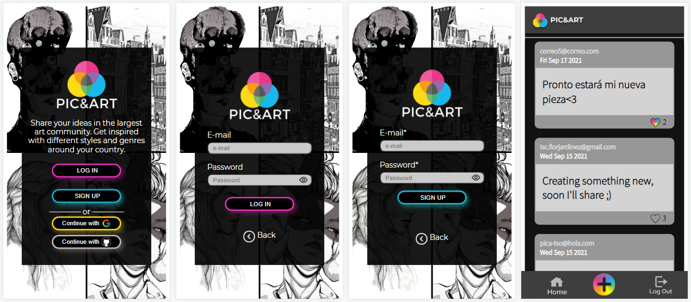

Interfaz para computadoras: 

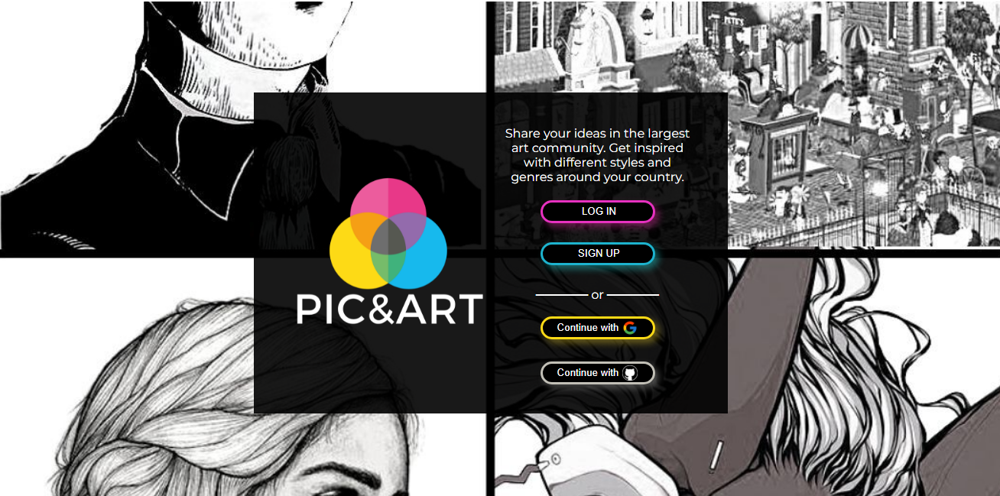
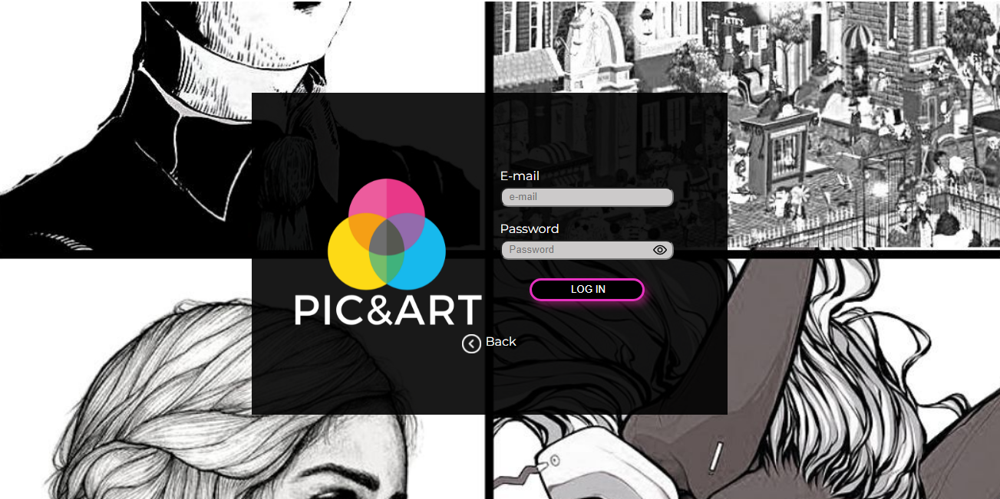
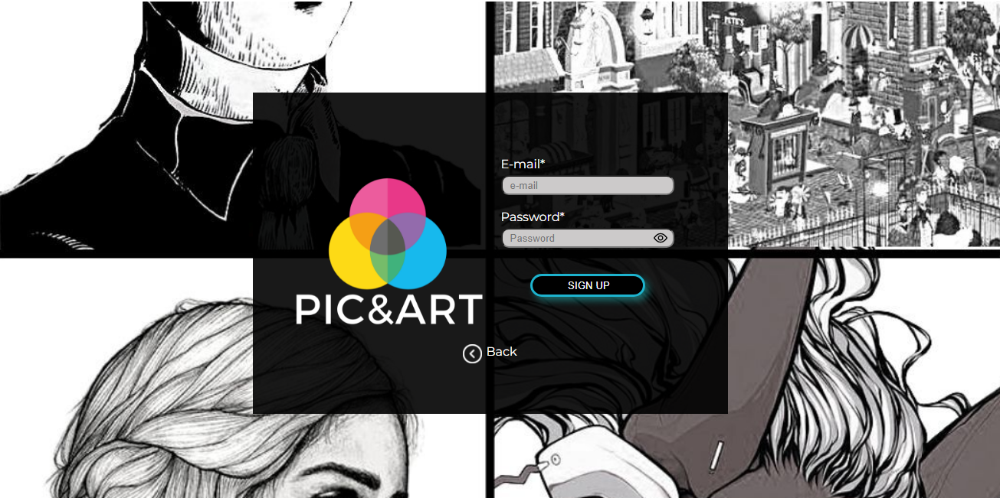

 